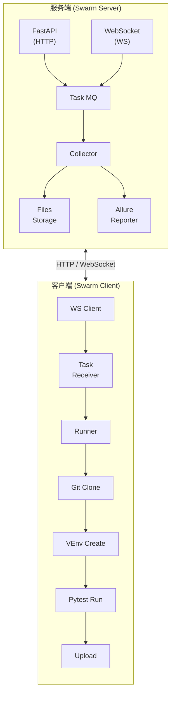

# 🐝 Swarm - 分布式自动化测试执行框架

> "让测试飞一会儿" — 这是 Swarm 的口号，也是我们每一位测试工程师的终极梦想。

## 背景故事

每一位测试工程师都经历过这样的至暗时刻：

- 测试用例跑了 3 小时，结果单机扛不住，所有用例全部卡死 🤯
- 几十台测试机器各跑各的，全靠手动分配任务，累觉不爱
- 测试报告 generate 了 100 次，手动打包上传累断手
- 每次换环境，依赖安装到怀疑人生

**Swarm 就是来解决这些痛点的。**

## 🐝 Swarm 是什么？

Swarm 是一个分布式自动化测试执行框架，简单来说就是：**让测试用例自己找人跑，自己跑完自己报**。

你可以理解为它是 `pytest-xdist` 的 Plus Pro Ultra 版：
- 有任务队列（不用每次手动分配）
- 有 Web 管理界面（不用命令行硬撑）
- 有自动报告生成（不用手动 Allure）
- 有客户端心跳检测（不怕机器跑路）
- 有虚拟环境管理（不怕依赖炸锅）

## ✨ 核心特性

| 特性 | 说明 |
|------|------|
| 🚀 动态分发 | 客户端空闲了会自动领任务，不用人工干预 |
| 📦 多客户端 | 支持 N 台机器并发跑，互不干扰 |
| 🔄 WebSocket | 实时日志推送，连接稳定，断线自动重连 |
| 📊 Allure 全家桶 | 自动收集结果，一键生成 HTML 报告 |
| 🖥️ CLI + API | 命令行和 Web API 双通道，想怎么玩怎么玩 |
| 🌍 内网友好 | 零外网依赖，自托管文档 |

## 🏃 快速开始

### 1. 安装（就一行）

```bash
pip install swarm
```

### 2. 启动服务端（选个端口，默认 8000）

```bash
# 默认端口
swarm server start

# 自定义端口
swarm server start --port 9000
```

服务端启动后，你可以：
- 访问 `http://localhost:8000` 看根路径
- 访问 `http://localhost:8000/docs` 看 API 文档
- 访问 `http://localhost:8000/api/reports/{task_id}` 看测试报告

### 3. 启动客户端（在测试机器上）

```bash
# 连接默认服务端
swarm client start

# 连接远程服务端
swarm client start --server http://192.168.1.100:8000
```

多开几个终端，就是多台客户端。简单粗暴。

### 4. 创建任务（怎么高兴怎么来）

**方式一：直接命令行刚**

```bash
# 跑通用的测试
swarm run tests/ --repo https://github.com/xxx/tests.git -b main

# 加点过滤条件
swarm run tests/api/ -k "test_user" -m "smoke" \
    --repo https://github.com/xxx/tests.git -b main \
    --client-timeout=60 --client-reruns=2
```

**方式二：配置文件（正式环境推荐）**

```json
{
  "name": "API Regression",
  "repo_url": "https://github.com/xxx/tests.git",
  "branch": "main",
  "test_paths": ["tests/api/", "tests/integration/"],
  "filter_args": {
    "k": "api",
    "m": "regression"
  },
  "client_args": {
    "timeout": 120,
    "reruns": 2
  }
}
```

保存为 `task.json`，然后：

```bash
swarm run --config task.json
```

### 5. 查看任务状态

```bash
# 任务列表
swarm task list

# 指定状态筛选
swarm task list --status running

# 任务详情
swarm task info <task_id>

# 取消任务
swarm task cancel <task_id>
```

任务列表支持自定义列配置，详见配置文件章节。

## ⚙️ 配置文件

默认配置路径：`~/.swarm/config.yaml` 或项目根目录 `swarm.config.yaml`

```yaml
task:
  list:
    # 显示哪些列
    columns:
      - id
      - name
      - status
      - created_at
      - duration
      - ip
      - passed
      - failed
      - report_url
    
    # 列宽
    width:
      id: 36
      name: 20
      report_url: 30
    
    # 状态颜色（支持 green, red, yellow, blue, gray, cyan, magenta, white）
    color:
      passed: green
      failed: red
      running: yellow
      pending: blue
      completed: green
      cancelled: gray
```

## 📡 API 接口

| 方法 | 路径 | 说明 |
|------|------|------|
| POST | `/api/tasks` | 创建任务 |
| GET | `/api/tasks` | 任务列表 |
| GET | `/api/tasks/{task_id}` | 任务详情 |
| DELETE | `/api/tasks/{task_id}` | 取消任务 |
| POST | `/api/tasks/{task_id}/retry` | 重试任务 |
| POST | `/api/tasks/{task_id}/upload` | 上传 Allure 结果 |
| GET | `/api/clients` | 客户端列表 |
| GET | `/api/clients/{client_id}` | 客户端详情 |
| GET | `/api/reports/{task_id}` | 测试报告 |
| WS | `/ws/{client_id}` | WebSocket 连接 |

## 🏗️ 架构概览



## 📦 项目结构

```
swarm/
├── swarm/
│   ├── server/           # 服务端
│   │   ├── main.py      # FastAPI 入口
│   │   ├── api.py       # API 路由
│   │   ├── websocket.py # WebSocket 处理
│   │   ├── task.py      # 任务管理
│   │   ├── client.py   # 客户端管理
│   │   ├── collector.py # 用例收集
│   │   └── report.py   # 报告生成
│   ├── client/          # 客户端
│   │   ├── runner.py   # 任务执行
│   │   ├── git.py    # Git 操作
│   │   ├── venv.py   # 虚拟环境管理
│   │   └── uploader.py # 结果上传
│   └── cli/            # CLI 命令
│       ├── main.py     # CLI 入口
│       ├── task.py    # 任务命令
│       └── config.py  # 配置管理
├── tests/              # 测试用例
├── docs/              # 文档
│   ├── requirements.md # 需求规格
│   └── architecture.md # 架构设计
├── PROGRESS.md         # 项目进度
├── pyproject.toml     # 项目配置
└── README.md          # 你正在看的文档
```

## 🔧 技术栈

| 类别 | 技术 |
|------|------|
| Web 框架 | FastAPI |
| WebSocket | websockets |
| 日志 | loguru |
| HTTP 客户端 | httpx |
| 数据验证 | pydantic |
| 测试报告 | Allure |
| Git 操作 | GitPython |
| 虚拟环境 | uv / pipenv / venv |
| CLI | click |
| 终端表格 | rich |

## 🤝 贡献指南

欢迎提 Issue 和 PR！

## 📄 License

MIT - 随便用，开心就好。

---

**最后一句话：测试本该如此简单。** 🐝